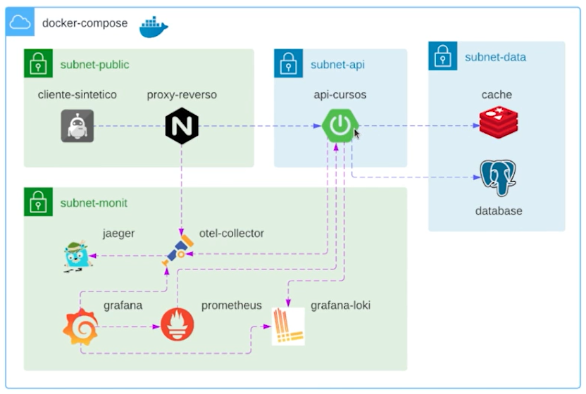

## Esquema da aplicação

## Documentação
- [Jaeger](https://www.jaegertracing.io/)
- [OpenTelemetry](https://opentelemetry.io/)
  - [Repositório](https://github.com/open-telemetry/opentelemetry-java-instrumentation)

## Instalações
- [Docker Desktop](https://docs.docker.com/desktop/install/windows-install/)
- [WSL](https://learn.microsoft.com/pt-br/windows/wsl/install)
- [Docker Compose](https://docs.docker.com/compose/install/)
- [Maven](https://maven.apache.org/install.html)
- [Java](https://www.oracle.com/java/technologies/downloads/)
  - [JDK 11](https://www.oracle.com/br/java/technologies/javase/jdk11-archive-downloads.html)
- IDE ([IntelliJ](https://www.jetbrains.com/pt-br/idea/#), [Eclipse](https://eclipseide.org/), etc.)

## Grafana
- 1º Adicione o datasource Prometheus (URL: http://prometheus-api-cursos:9090)
- 2º Adicione o datasource Loki (URL: http://loki-api-cursos:3100)
- 3º Importar o dashboard (`template/api-cursos-dashboards.json`)
- 4º Atualize o datasource nas variáveis do dashboard para Prometheus
- 5º Em algumas versões do Grafana há um bug, então...
  - Pode ser necessário editar os paineis, clicar na query e clica em outro local da tela (e assim o resultado será exibido)
  - Recarregar a aplicação e fazer o acesso via navegador

## Comandos
- `mvn clean package` realiza o empacotamento do projeto, criando o arquivo JAR ou WAR
- `java -javaagent:opentelemetry/opentelemetry-javaagent.jar -Dotel.service.name=api-cursos -Dotel.traces.exporter=otlp -Dotel.metrics.exporter=none -Dotel.integration.jdbc.datasource.enabled=true -Dotel.instrumentation.jdbc.datasource.enabled=true -Dotel.exporter.otlp.endpoint=http://localhost:4318 -Dotel.exporter.otlp.protocol=http/protobuf -jar target/*.jar` rodando a aplicação com o agent do OpenTelemetry
  > Utilizar GitBash caso esteja no Windows.